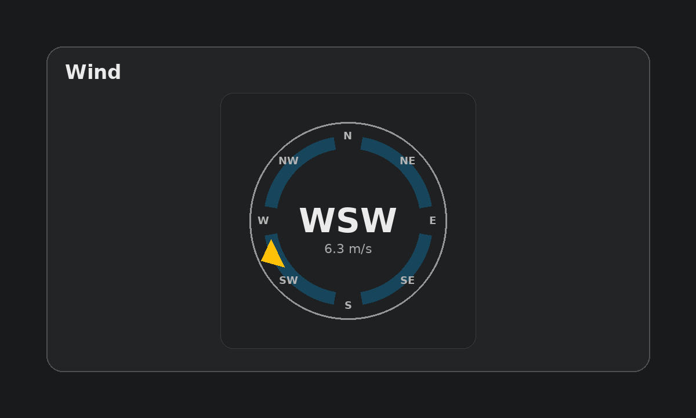

# WU Wind Compass Card (Home Assistant)

A Lovelace custom card that shows **wind direction** as a **compass with a wedge pointer** and a **segmented band**, with i18n support (**EN/CZ**) and a built-in **GUI editor**.



## Features

- Compass-style design with:
  - segmented band (4 arcs, with gaps near cardinal points)
  - wedge/pointer indicating the current wind direction
- Center label uses **16-point compass** (localized)
- Optional wind speed display (unit auto-detected from sensor attribute)
- Optional smoothing (`smooth_deg`) to reduce jitter
- Built-in GUI editor (ha-form)

## Installation

### HACS (recommended)

1. HACS → **Frontend** → **Custom repositories**
2. Add your GitHub repo URL and select **Lovelace**
3. Install **WU Wind Compass Card**
4. Reload resources (or restart Home Assistant)

Then add the resource:

- **Settings → Dashboards → Resources → Add resource**
- URL: `/hacsfiles/wu-wind-compass-card/wu-wind-compass-card.js`
- Type: **JavaScript Module**

### Manual

1. Copy `wu-wind-compass-card.js` to:
   - `/config/www/wu-wind-compass-card.js`
2. Add the resource:

- URL: `/local/wu-wind-compass-card.js`
- Type: **JavaScript Module**

## Usage

### Minimal

```yaml
type: custom:wu-wind-compass-card
entity_direction: sensor.wind_bearing
```

### With speed

```yaml
type: custom:wu-wind-compass-card
name: Wind
entity_direction: sensor.wind_bearing
entity_speed: sensor.wind_speed
```

### Example (tuning)

```yaml
type: custom:wu-wind-compass-card
name: Wind
entity_direction: sensor.wind_bearing
entity_speed: sensor.wind_speed
language: auto   # auto/en/cs (auto uses HA language / browser)
size: 240
wedge_width_deg: 22.5
smooth_deg: 2
font_center_px: 28
font_labels_px: 14
font_speed_px: 13
wedge_color: var(--accent-color)
segment_color: "rgba(3, 169, 244, 0.18)"
outer_stroke: "var(--ha-card-border-color, rgba(127,127,127,0.35))"
label_color: var(--secondary-text-color)
center_text_color: var(--primary-text-color)
```

## Configuration

| Key | Type | Default | Description |
|---|---:|---:|---|
| `entity_direction` | string | **required** | Sensor with wind direction in degrees (0–360). |
| `entity_speed` | string | — | Optional sensor with wind speed. |
| `speed_unit` | string | — | Optional unit override (e.g. `m/s`, `km/h`). If not set, unit is read from the speed entity. |
| `show_speed` | boolean | `true` | Show speed text under the center label. |
| `name` | string | `Wind` | Card header. |
| `language` | string | auto | `auto`, `en`, or `cs`. Use `auto` (or omit) for HA/browser detection. |
| `size` | number | `220` | Card SVG size (px). |
| `wedge_width_deg` | number | `22.5` | Pointer wedge width in degrees. |
| `smooth_deg` | number | `0` | If non-zero, keeps last direction if change is smaller than this threshold. |
| `outer_stroke` | string | theme-based | Outer ring stroke color. |
| `segment_color` | string | `rgba(3, 169, 244, 0.18)` | Segmented band color. |
| `label_color` | string | theme-based | Label text color. |
| `center_text_color` | string | theme-based | Center text color. |
| `wedge_color` | string | theme-based | Wedge fill color. |
| `font_labels_px` | number | `14` | Label font size. |
| `font_center_px` | number | `28` | Center label font size. |
| `font_speed_px` | number | `13` | Speed font size. |

## Notes

- Direction is normalized to `[0..360)`.
- The center label shows **16-point** cardinal text (localized), while the ring labels are **8-point** (localized).
- Speed is formatted with 1 decimal and unit is auto-detected from `unit_of_measurement`.

## Troubleshooting

- **Card not loading**: verify the resource URL and type (**JavaScript Module**) in **Settings → Dashboards → Resources**.
- **No wedge / center shows “—”**: make sure `entity_direction` provides a numeric state in degrees.
- **Speed missing unit**: either ensure your speed sensor has `unit_of_measurement`, or set `speed_unit:`.

## Changelog

- **v1.4.0**
  - Wedge/segment design with transparent empty areas
  - i18n (en, cs)
  - GUI editor (ha-form) and additional tuning options
